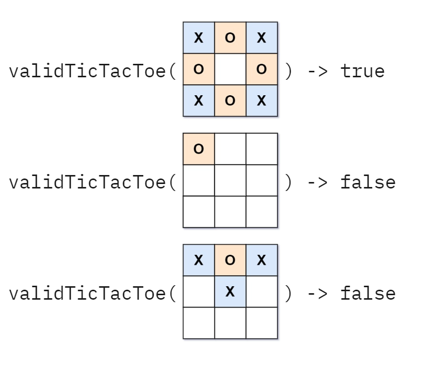

# Kata Tic-Tac-Toe with Test-Commit-Revert

A kata with [test && commit || revert](https://medium.com/@kentbeck_7670/test-commit-revert-870bbd756864) using the template [andrej-dyck/kata-template-tcr](https://github.com/andrej-dyck/kata-template-tcr).

## Task

Check if a given [tic-tac-toe](https://en.wikipedia.org/wiki/Tic-tac-toe) grid is a valid state in a game. Based on [leetcode problem 794](https://leetcode.com/problems/valid-tic-tac-toe-state/).

**Examples**

